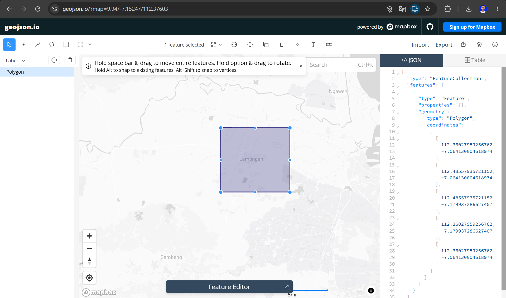
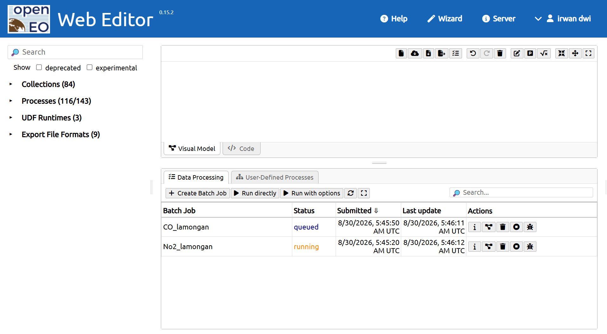
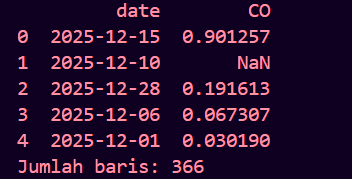
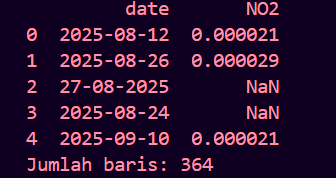

---
jupytext:
  formats: md:myst
  text_representation:
    extension: .md
    format_name: myst
    format_version: 0.13
    jupytext_version: 1.11.5
kernelspec:
  display_name: Python 3
  language: python
  name: python3
---

# Data Understanding

## Pengumpulan Data

Langkah pertama yaitu mengumpulkan data polutan udara NO₂ dan CO. Dataset ini mengambil dari platform satelit [Copernicus Data Space Ecosystem](https://dataspace.copernicus.eu/).

### Install Library & Autentikasi

Kita membutuhkan pustaka Python pendukung yaitu `openeo` untuk berkomunikasi dengan API Copernicus.

```{code-cell}

pip install openeo
```

Menghubungkan ke server openEO dan melakukan autentikasi menggunakan akun Copernicus Data Space.

```{code-cell}
import openeo

connection = openeo.connect("openeo.dataspace.copernicus.eu").authenticate_oidc()
```

Saat menjalankan baris di atas, akan muncul permintaan autentikasi:

```
Visit (link authentikasi) 📋 to authenticate.
✅ Authorized successfully
Authenticated using device code flow.
```

### Pengambilan Data NO₂ dan CO Area Wilayah Lamongan

Langkah berikutnya adalah menentukan wilayah spesifik. Titik koordinat batas wilayah Lamongan (Poligon) didapatkan menggunakan alat bantu pemetaan [geojson.io](https://geojson.io) dengan menggambar kotak di atas wilayah.



Koordinat yang didapatkan dimasukkan ke dalam variabel Area of Interest. Satelit Sentinel-5P kemudian diminta untuk mengambil data polutan berdasarkan _bounding box_ wilayah tersebut.

Mengingat satelit dapat merekam suatu area lebih dari satu kali dalam sehari, proses **agregasi temporal harian** diterapkan untuk mendapatkan satu nilai rata-rata per hari. Selanjutnya, dilakukan **agregasi spasial** guna merata-ratakan seluruh _grid_ di wilayah Lamongan menjadi satu representasi nilai tunggal.

### Memuat Data CO

```{code-cell}
s5 = connection.load_collection(
    "SENTINEL_5P_L2",
    temporal_extent=["2025-08-24", "2026-08-24"],
    spatial_extent={
        "west": 112.3602,
        "south": -7.1799,
        "east": 112.4855,
        "north": -7.0641,
    },
    bands=["CO"],
)
```

### Memuat Data NO2

```{code-cell}
s5 = connection.load_collection(
    "SENTINEL_5P_L2",
    temporal_extent=["2025-08-24", "2026-08-24"],
    spatial_extent={
        "west": 112.3602,
        "south": -7.1799,
        "east": 112.4855,
        "north": -7.0641,
    },
    bands=["NO2"],
)
```

Proses di jalankan batch job di server openEO, dan hasilnya dapat dipantau melalui openEO Web Editor. [openEO editor](https://editor.openeo.org/?server=https%3A%2F%2Fopeneo.dataspace.copernicus.eu%2Fopeneo%2F1.2). Setelah diproses oleh server, output akan otomatis diunduh dalam format **CSV**.



### Hasil CSV

Disini memuat file CSV CO dan NO2 yang telah menggunakan pustaka Pandas. Dan disini kita hanya akan menampilkan 5 data teratas saja.

1. CO

```{code-cell}
:tags: [hide-input]
import pandas as pd
import numpy as np
df = pd.read_csv("../../data/CO_lamongan.csv")
df.head(5)
```



2. NO2

```{code-cell}
:tags: [hide-input]
df = pd.read_csv("../../data/No2_lamongan.csv")
df.head(5)
```



## Data Kosong (Missing Values)

Ketidaklengkapan data atau _missing values_ merujuk pada situasi di mana titik-titik pengamatan tertentu tidak memiliki nilai ukur yang tercatat. Dalam konteks observasi satelit berbasis deret waktu, hilangnya data tersebut adalah hal yang lumrah. Pemicu utamanya berkisar dari halangan fisis seperti awan tebal yang menutupi area pandang sensor, hingga pola pergerakan orbit satelit yang menyebabkan absennya perekaman wilayah tersebut pada hari-hari tertentu. Mengenali rumpang data ini adalah prasyarat mutlak sebelum proses analisis dieksekusi.

Disini kita mengecek missing values_:
**Data yang Hilang**: Memeriksa jumlah nilai polutan yang kosong (`NaN`) pada record tanggal yang sudah terekam.


### Data Yang Hilang

Kita juga akan mengecek jumlah baris data yang memiliki nilai konsentrasi polutan kosong .

1. CO

```{code-cell}
df = pd.read_csv("../../data/CO_lamongan.csv")
missing_value = df['CO'].isna().sum()
print(missing_value)
```

Implementasi pada tools `Orange Data Mining`

```{image} ../img/missing_co.png
:alt: Grafik Data
:width: 100%
:align: center
```

2. NO₂

```{code-cell}
df = pd.read_csv("../../data/No2_lamongan.csv")
missing_value = df['NO2'].isna().sum()
print(missing_value)
```

Implementasi pada tools `Orange Data Mining`

```{image} ../img/missing_no2.png
:alt: Grafik Data
:width: 100%
:align: center
```

## Outliers

Data ekstrem atau _outliers_ adalah nilai observasi yang berada sangat jauh dari rentang nilai wajar sebuah dataset. Untuk studi polusi udara, keberadaan angka ekstrem ini bisa merefleksikan kejadian nyata, seperti tiba-tiba naiknya emisi pabrik atau kebakaran lahan, ataupun sebatas kesalahan teknis (_error_) pada instrumen penginderaan jauh satelit.

Dalam upaya mendeteksi anomali tersebut di fase pemahaman data, kita memanfaatkan algoritma **Isolation Forest** dari modul `scikit-learn`. Mekanisme kerjanya adalah dengan membelah data secara acak untuk memisahkan observasi; logika utamanya adalah bahwa data yang anomali akan jauh lebih cepat terpisah ketimbang data yang normal. Dengan menentukan persentase toleransi pencilan (_contamination_) di angka 5%, model ini akan memetakan hasil. Tiap observasi yang ditandai dengan nilai prediksi `-1` dipastikan sebagai titik anomali.

1. CO

```{code-cell}
import pandas as pd
from sklearn.ensemble import IsolationForest

df = pd.read_csv("../../data/CO_lamongan.csv")
df_clean = df.dropna(subset=['CO']).copy()

model = IsolationForest(contamination=0.05, random_state=42) # contamination 0.05 = 5%
pred = model.fit_predict(df_clean[['CO']])

# Nilai -1 merepresentasikan outlier
jumlah_outlier = (pred == -1).sum()
print("Jumlah outlier:", jumlah_outlier)
```

Implementasi pada tools `Orange Data Mining`

```{image} ../img/outlier_co.png
:alt: Grafik Data
:width: 100%
:align: center
```

2. NO₂

```{code-cell}
import pandas as pd
from sklearn.ensemble import IsolationForest

df = pd.read_csv("../../data/No2_lamongan.csv")
df_clean = df.dropna(subset=['NO2']).copy()

model = IsolationForest(contamination=0.05, random_state=42) # contamination 0.05 = 5%
pred = model.fit_predict(df_clean[['NO2']])

# Nilai -1 merepresentasikan outlier
jumlah_outlier = (pred == -1).sum()
print("Jumlah outlier:", jumlah_outlier)
```

Implementasi pada tools `Orange Data Mining`

```{image} ../img/outlier_no2.png
:alt: Grafik Data
:width: 100%
:align: center
```
